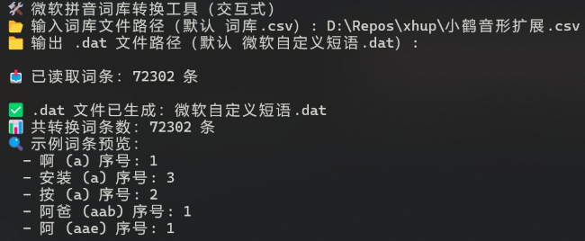
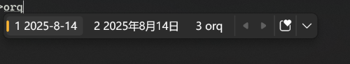

## 使用说明
1. 本词库修改自小鹤音形官网的外挂码表
2. 在输入法设置界面可导入自定义短语即可，没有“·”键通配，但是可以使用“‘”进行半通配。
   
3. 如需要修改或打造自己的词库，请按照文件的编码格式进行修改。
4. 修改后可以在https://gaoweix.com/im-dict-converter/  进行转换。或使用我提供的ms_pinyin_tools.py脚本进行转换……
   转换结果为.dat文件，可在输入法设置界面导入。
   在安装了python的情况下，双击运行ms_pinyin_tool.py
   
5. 常用符号采用了老版本的快捷符号如（半角符号）  
   ow	= ？  
   oa	= ！  
   of = ；  
   os = ……  
   od = 、  
   op = ～  
   oq	= ‰  
   ob	= %  
   ok/ol	=《/》  
   oz/oc	=“  
   oh/oj = (/) 
## 使用方法
1. 下载注册表文件并导入以设置微软拼音双拼方案为小鹤双拼
2. 导入小鹤双拼自定义短语 dat文件以实现挂接小鹤音形码表
3. 如果需要自定义修改，请按照使用说明进行修改和定义……
4. 既可以享受小鹤音型的准确性，又能享受智能拼音的词库丰富性，可以打长句……

## 其它说明
1. 基础版本不包含日期时间/符号/Emoji等编码。
2. 输入“wrxh” 即可快速输入ChsPinyinEUDPv1.lex文件路径。
3. 重新导入时如遇卡顿需要手动删除ChsPinyinEUDPv1.lex文件，然后导入新的文件。
4. 如果没有小鹤双拼方案键盘，可导入注册表文件以开启。 
5. 在微软拼音设置界面，设置如下
   - 关闭自动扩展到全拼
   - 关闭超级简拼
   - 候选次数推荐3-5个
   - 建议打开动态词频调整并开启自学习
   - 可以必要的开启专业词典（根据需求）
   - 关闭 web文本建议。  
6. 词库文件差别
   - 单字版包含单字，符号，部分emoji，和时间日期短语等。约1.2万词条
   - 扩展版为官方版x编码，包含单字，所有符号，短语等。约7.2万词条,
   - 精简版为在官方10.xx的基础上，删除了不常用符号（俄语符号，日语片假名，部分emoji等），并删除了所有四字以上的短语。约6.9万词条
   - 自用版只有单字，二字词、几个3字词、时间符号和数个emoji等，因为微软拼音自带词库，所以不需要定义太大的词库……😁
## 💖关于微软拼音自定义时间和日期短语的说明
   - 由于微软拼音的一些内部原因，如果用户按照官方的方法定义一些日期或者时间短语会出现时间日期不会随系统变化的问题，
   - 官方定义
      定义举例 %yyyy% 即用单%号定义变量。但会造成日期时间不会随系统时间变化的问题。
   - 解决办法
      使用%%来引用变量 
      
      举例 %%yyyy%%-%%m%%-%%dd%%即可解决官方方法造成的bug……
   - 使用周%%w%% 可以定义周几，但是只能显示阿拉伯数字。不建议使用。
	

