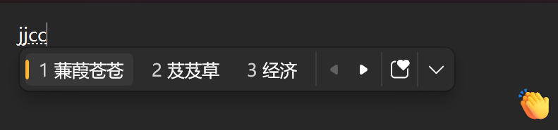

## 使用说明
1. 本词库修改自小鹤音形官网的外挂码表
2. 如需要修改请按照文件的编码格式进行修改。
3. 修改后打开下面网站进行转换格式为微软拼音自定义短语
   ​         https://gaoweix.com/im-dict-converter/
   ​         然后导出并下载保存为.dat文件。
4. 在输入法设置界面可导入自定义短语即可。
   
5. 常用符号采用了老版本的快捷符号如
   ow ？
   oa ！
   oz/oc “/”
   oq  ‰
   ob  %
   ok/ol 《/》

## 使用方法
1. 下载注册表文件并导入以设置微软拼音双拼方案为小鹤双拼
2. 导入小鹤双拼自定义短语 dat文件以实现挂接小鹤音形码表
3. 如果需要自定义修改，请按照使用说明进行修改和定义……

## 其它说明
1. 基础版本不包含日期时间/符号/Emoji等编码。
2. 输入“wrxh” 即可快速输入ChsPinyinEUDPv1.lex文件路径。
3. 重新导入时如遇卡顿需要手动删除ChsPinyinEUDPv1.lex文件，然后导入新的文件。
4. 如果没有小鹤双拼方案键盘，可导入注册表文件以开启。 
5. 在微软拼音设置界面，设置如下
   - 关闭自动扩展到全拼
   - 关闭超级简拼
   - 候选次数推荐3-5个
   - 关闭动态词频调整
   - 开启自学习
   - 可以开启专业词典（根据需求）
   - 关闭 web文本建议。  
6. 文件差别
   - 基础版本只有单字和短语，不包含符号、emoji、日期短语等。约5.6万词条
   - 扩展版为官方10.xx编码，包含单字，所有符号，短语等。约7.2万词条
   - 精简版为在官方10.xx的基础上，删除了不常用符号（俄语符号，日语片假名，部分emoji等），并删除了所有四字以上的短语。约6.9万词条
